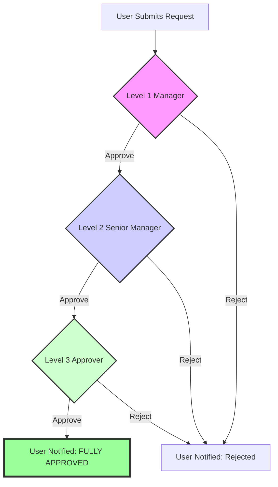

   └─ All future requests │             │
     include token in     │             │
     Authorization header │             │
                          │             │
   ├─ GET /api/requests   │             │
   │  + Authorization     │             │
   │──────────────────────→│            │
   │                       ├─ Verify JWT│
   │                       ├─ Extract   │
   │                       │ user ID    │
   │                       │            │
   │                       ├─ Get data  │
   │                       │───────────→│
   │◄──────────────────────│            │
   │ 200 OK + Data         │            │
   │                       │            │
```

---

## State Management (Frontend)

```
App Component (Root)
│
├─ Auth Context
│  ├─ currentUser
│  ├─ token
│  ├─ isAuthenticated
│  ├─ login()
│  ├─ logout()
│  └─ register()
│
├─ Request Context
│  ├─ requests[]
│  ├─ currentRequest
│  ├─ createRequest()
│  ├─ updateRequest()
│  ├─ submitRequest()
│  └─ deleteRequest()
│
└─ Approval Context
   ├─ pendingApprovals[]
   ├─ approvalHistory[]
   ├─ approveRequest()
   ├─ rejectRequest()
   └─ getApprovalStats()
```

---

## Security Layers

```
Client (React)
    │
    ├─ HTTPS/TLS encryption
    ├─ JWT token storage (localStorage)
    └─ CSRF tokens
    │
    ↓
Server (Node.js)
    │
    ├─ CORS validation
    ├─ JWT verification
    ├─ Role-based authorization
    ├─ Input validation
    ├─ Rate limiting
    ├─ SQL injection prevention
    └─ Error message sanitization
    │
    ↓
Database (MongoDB)
    │
    ├─ Password hashing (bcrypt)
    ├─ Data encryption
    ├─ Access control
    └─ Audit logging
```

---

## Deployment Architecture (Future)

```
┌────────────────────────────────────────────────────────────┐
│                   CLIENT LAYER                             │
│         (Static Files) + Frontend (React)                  │
└────────────────────────────────────────────────────────────┘
                         │ HTTPS
                         ↓
┌────────────────────────────────────────────────────────────┐
│                   API LAYER (Cloud)                        │
│  ├─ Load Balancer                                          │
│  ├─ Backend Server Instances (Node.js + Express)           │
│  ├─ Auto-scaling                                           │
│  ├─ Caching Layer (Redis)                                  │
│  └─ Environment variables & secrets management             │
└────────────────────────────────────────────────────────────┘
                         │
                         ↓
┌────────────────────────────────────────────────────────────┐
│                   DATABASE LAYER                           │
│  ├─ MongoDB Atlas (Managed service)                        │
│  ├─ Automated backups                                      │
│  ├─ High availability (Replica sets)                       │
│  └─ Data encryption at rest & in transit                   │
└────────────────────────────────────────────────────────────┘
                         │
                         ↓
┌────────────────────────────────────────────────────────────┐
│              MONITORING & LOGGING                          │
│  ├─ Application Insights / Datadog                         │
│  ├─ Error tracking (Sentry)                                │
│  ├─ Log aggregation (CloudWatch, ELK)                      │
│  └─ Performance monitoring                                 │
└────────────────────────────────────────────────────────────┘
```

---

## Technology Stack Summary

| Layer | Technology | Purpose |
|-------|-----------|---------|
| **Frontend** | React.js | User interface |
| | React Router | Navigation & routing |
| | Axios | HTTP client |
| | CSS/Bootstrap | Styling |
| **Backend** | Node.js | Runtime environment |
| | Express.js | Web framework |
| | Mongoose | ODM for MongoDB |
| | JWT | Authentication |
| | bcryptjs | Password hashing |
| **Database** | MongoDB | NoSQL database |
| | MongoDB Atlas (Prod) | Managed database service |
| **DevOps** | Git | Version control |
| | Render | Hosting (Backend) |
| | Vercel | Hosting (Frontend) |

---

## Email Approval Workflow

The system uses **Nodemailer** to facilitate the transition between approval tiers. This ensures that no request sits idle and managers are notified instantly.

### Notification Flow



1.  **Level 1 Interaction**: Direct links in the email allow for "Quick Approval" without logging in.
2.  **State Transition**: Each approved level triggers a `Status Update` in the database and a `New Email` to the next responsible party.
3.  **Finality**: The original requester receives a confirmation email only after the final sign-off (Level 3).

---

This architecture provides:
- ✅ Clear separation of concerns
- ✅ Scalability
- ✅ Security
- ✅ Maintainability
- ✅ Testability
